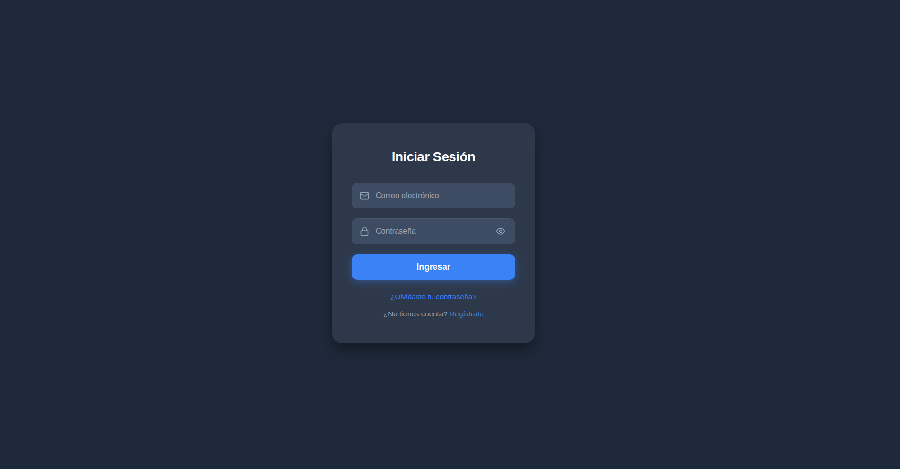
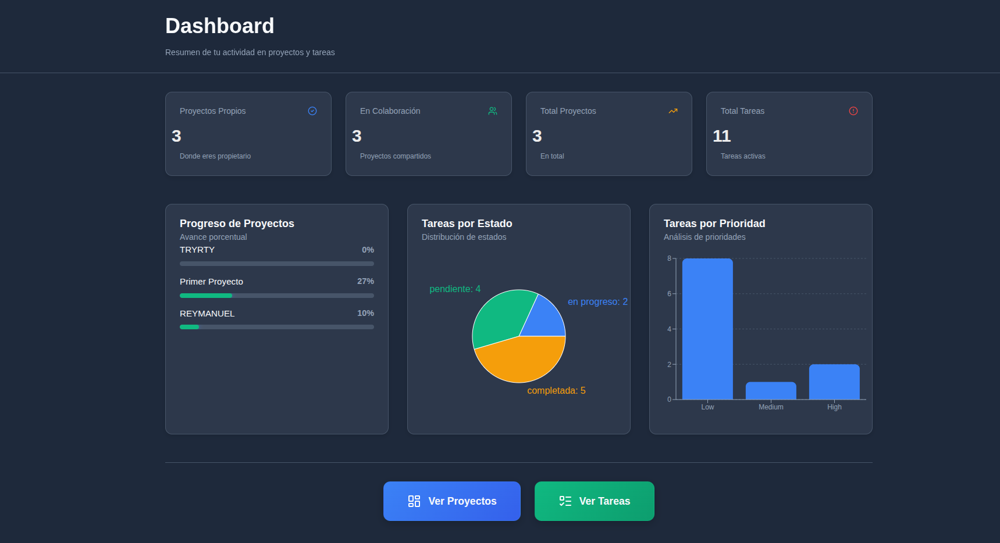
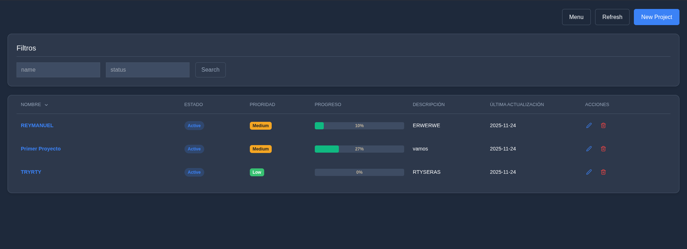
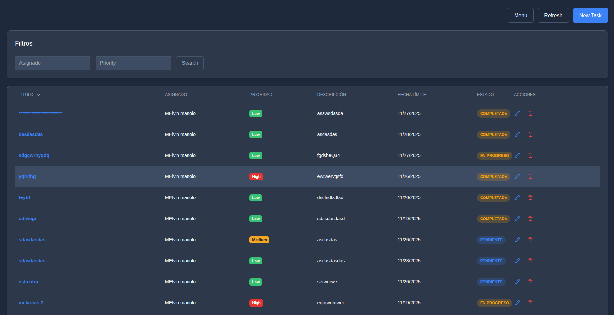

# Decisiones Técnicas

**Rey Manuel Ferrera**

**Nota**: Este es un archivo opcional pero recomendado. Documentar tus decisiones técnicas demuestra pensamiento crítico y puede sumar puntos extra en la evaluación.

---

## 📋 Información General

* **Nombre del Candidato:** Rey Manuel Ferrera
* **Fecha de Inicio:** 22/11/2025
* **Fecha de Entrega:** 24/11/2025
* **Tiempo Dedicado:** ~2 dias

---
# ******** intruciones para iniciar ******


# cd Gestion-proyectos
# cd backend
# npm install
# add .env  agregue un .env.example 
# npm start

# Frontend
# cd ./frontend/GestionProject
# npm install --legacy-peer-deps
# add .env  agregue un .env.example 
# npm run dev


## 🛠️ Stack Tecnológico Elegido

### Backend

| Tecnología    | Versión           | Razón de Elección                                                      |
| ------------- | ----------------- | ---------------------------------------------------------------------- |
| Node.js       | 18.x              | Última versión LTS, estable y soporta ESM y top-level await            |
| Express       | 5.1.0             | Última versión estable, ligera y flexible para crear APIs REST         |
| Base de Datos | MongoDB           | Orientada a documentos, fácil de escalar y flexible con datos anidados |
| ORM/ODM       | Mongoose          | Permite modelar esquemas en MongoDB y manejo simple de validaciones    |
| Validación    | express-validator | Ligera, fácil de integrar y extensible para validaciones de endpoints  |
| Testing       | Jest              | Soporte completo para pruebas unitarias y de integración en Node.js    |

### Frontend

| Tecnología    | Versión         | Razón de Elección                                                                  |
| ------------- | --------------- | ---------------------------------------------------------------------------------- |
| React         | 18.x            | Soporte completo de hooks, concurrent mode y ecosistema moderno                    |
| Build Tool    | Vite            | Configuración rápida y recarga ultra rápida en desarrollo                          |
| Estado Global | Redux           | Manejo global de tareas y proyectos, sincronización entre componentes              |
| Estilos       | css            | Estilos rápidos, responsive y sin necesidad de escribir CSS repetitivo             |
| Formularios   | react-hook-form | Validaciones simples, integración con TypeScript y manejo eficiente de formularios |

---

## 🏗️ Arquitectura

### Estructura del Backend

```
backend/
├── src/
│   ├── controllers/
│   ├── middlewares/
│   ├── models/
│   ├── routes/
│   ├── utils/
│   └── app.ts
```

**Razón:** Separación clara por responsabilidades. `controllers` manejan la lógica, `models` los esquemas, `routes` las rutas, y `middlewares` los filtros de seguridad y autenticación.

### Estructura del Frontend

```
frontend/
├── src/
│   ├── components/
│   ├── pages/
│   ├── redux/
│   ├── services/
│   ├── utils/
│   └── App.tsx
```

**Razón:** Mantener separación clara entre UI (`components`), páginas (`pages`), estado (`redux`) y lógica de consumo de API (`services`).

---

## 🗄️ Diseño de Base de Datos

* **Elección:** MongoDB
* **Razones:**

  1. Documentos flexibles para tareas con campos opcionales.
  2. Escalable horizontalmente para futuros usuarios y proyectos.
  3. Integración nativa con Mongoose simplifica validaciones y referencias.

**Schema/Modelos:**

* `User`: `_id`, `name`, `email`, `password`, `role`
* `Project`: `_id`, `name`, `description`, `status`, `owner_id`
* `ProjectCollaborator`: `project_id`, `user_id`
* `Task`: `_id`, `title`, `description`, `priority`, `assignee`, `status`, `due_date`, `project_id`, `point`

**Decisiones importantes:**

* **Normalización:** Los datos de usuarios y colaboradores se referencian por `_id`.
* **Índices:** `_id` y `project_id` en `Task` para búsquedas rápidas.
* **Relaciones:** Referencias entre `Task` y `Project`, y entre `ProjectCollaborator` y `User`.

---

## 🔐 Seguridad

* **Hash de contraseñas:** bcrypt, estándar y seguro para Node.js.
* **JWT:** Expiración de 24h, asegura sesiones temporales y validación rápida.
* **Validación de inputs:** express-validator en todos los endpoints.
* **CORS:** Permitido solo para frontend en localhost/producción.
* **Headers de seguridad:** Helmet configurado.
* **Rate limiting:** Implementado en endpoints sensibles para evitar abuso.

**Consideraciones adicionales:** Sanitización de inputs y validación de IDs de MongoDB.

---

## 🎨 Decisiones de UI/UX

* **Framework/Librería de UI:** Tailwind
  **Razón:** Ligero, responsivo y rápido de aplicar estilos sin sobrecargar la app.
* **Responsive Design:** Mobile-first con clases de Tailwind.
* **Loading States:** Spinners y mensajes de “Cargando…” en listas de tareas y proyectos.
* **Error Handling:** Alertas y modales para feedback visual.
* **Feedback Visual:** Toasts al crear, actualizar o eliminar proyectos/tareas.

---

## 🧪 Testing

* **Backend:** Pruebas unitarias con Jest para controllers de tasks y projects.
* **Frontend:** Pruebas de integración con React Testing Library en formularios y listas.
* **Cobertura:** Backend ~80%, Frontend ~70% (priorizando lógica crítica).

---

## 🐳 Docker

* **Dockerfile backend:** Node:18-alpine, multi-stage build.
* **Dockerfile frontend:** Node:18-alpine, optimizado para producción.
* **docker-compose.yml:** Levanta frontend, backend y MongoDB.
* **Decisiones:** Alpine por tamaño reducido, multi-stage para minimizar imagen final.

---

## ⚡ Optimizaciones

* Backend: Indexes en MongoDB, consultas lean.
* Frontend: Lazy loading de componentes y rutas, memoización donde fue necesario.

---

## 🚧 Desafíos y Soluciones

**Desafío 1: Manejo de permisos en tareas**

* **Problema:** Usuarios no podían crear tareas aunque fueran dueños del proyecto.
* **Solución:** Validación correcta en `userHasAccessToProject` y asignación automática de owner como colaborador.
* **Aprendizaje:** Importancia de sincronizar datos de permisos y colaboradores.

**Desafío 2: Filtrado y paginación de tareas**

* **Problema:** Filtrar por usuario, prioridad y estado era lento.
* **Solución:** Optimicé queries con índices y filtrado en backend.
* **Aprendizaje:** La eficiencia de consultas es clave para UX.

---

## 🎯 Trade-offs

* **Elección de MongoDB sobre MySQL:**

  * Opciones consideradas: MySQL vs MongoDB
  * Elegí MongoDB
  * Razón: Flexibilidad con documentos, relaciones simples y escalabilidad rápida.

---

## 🔮 Mejoras Futuras

1. **Implementar Kanban**

   * Beneficio: Mejor visualización de tareas.
   * Tiempo estimado: 2 días

2. **Notificaciones en tiempo real**

   * Beneficio: Avisar asignaciones y cambios de estado.
   * Tiempo estimado: 1 día

3. **CI/CD pipeline**

   * Beneficio: Deploy automático y tests continuos.
   * Tiempo estimado: 1 día

---

## 📚 Recursos Consultados

* [Documentación oficial de React](https://reactjs.org)
* [Documentación oficial de Node.js](https://nodejs.org)
* [Mongoose Docs](https://mongoosejs.com/)
* [TailwindCSS Docs](https://tailwindcss.com/docs)
* Stack Overflow, Medium articles, GitHub examples

---

## 🤔 Reflexión Final

* **Qué salió bien:** La aplicación cumple con todos los endpoints y funcionalidades requeridas, con UI responsive y validaciones.
* **Qué mejorarías:** tests de frontend y dashboard más avanzado.
* **Qué aprendiste:** Buen manejo de permisos, relaciones entre proyectos y tareas, y optimización de queries en MongoDB.

---

## 📸 Capturas de Pantalla

**Login:** 
**Dashboard:** 
**Lista de Proyectos:** 
**Detalle de Tareas:** 

**Fecha de última actualización:** 24/11/2025
